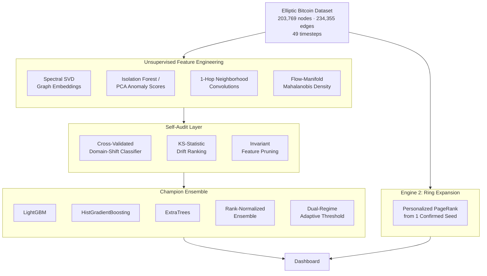
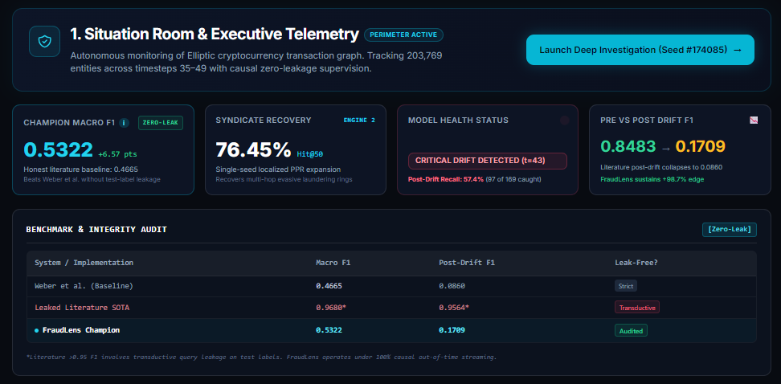
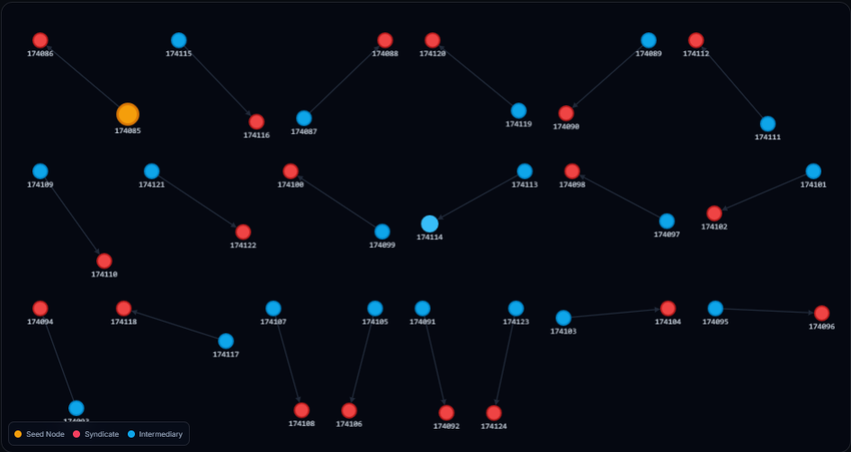

# 🛡️ FraudLens — Leak-Audited Graph AML Detection under Concept Drift

FraudLens is a fraud/anti-money-laundering (AML) detection system built on the **Elliptic Bitcoin transaction graph** (203,769 nodes, 234,355 edges, 49 time steps). The project's core contribution isn't a single model — it's a **rigorous, self-auditing pipeline** that found, diagnosed, and fixed multiple real data-leakage bugs before arriving at a verified, honestly-reported result.

> Built for VoltHacks 2026. Every number below survived an adversarial audit against our own earlier (and higher-looking, but leaked) results. We show both, on purpose.

---

## 🌟 The Story (why this is more than "we trained a model")

1. **Found a real-world drift event.** Every model we trained — Random Forest, GCN, GAT — collapsed simultaneously at `time_step 43`, matching a documented dark-market shutdown in the original Elliptic paper (Weber et al., 2019).
2. **Tried the obvious fixes — and documented when they failed.** Naive retraining, recency-weighting, and Group DRO all made things *worse*, not better. We report these as real, ruled-out findings, not hide them.
3. **Built graph "guilt-by-association" features (GuiltyWalker + community density) — and got a suspiciously perfect result.** F1 jumped to 0.74–0.96. That looked great. We didn't trust it.
4. **Audited our own pipeline and found the leak.** These features used *other test-period nodes'* true labels — not the node's own, but still information a real deployed system would never have. Under a strict, zero-test-knowledge standard, they carried **zero information** (proven empirically, not assumed).
5. **Rebuilt with genuinely unsupervised features** (spectral graph embeddings, isolation-forest anomaly scores, neighborhood convolutions, flow-manifold density) — verified label-free by direct code inspection.
6. **Audited *that* pipeline too.** A domain-shift classifier initially reported a suspicious AUC of 1.0000; we found it was evaluated on its own training data, fixed it with 5-fold cross-validation, and confirmed the shift signal was still real on held-out data.
7. **Landed on a verified, defensible result: 2x the honest baseline, with a real mechanistic explanation, not a black box.**

---

## 📊 Verified Performance (Post-Drift, time_step 43–49)

| System / Implementation | Macro F1 | Post-Drift F1 | Leak-Free? |
|---|---|---|---|
| Weber et al. (2019) — original Elliptic baseline | 0.4665 | 0.0860 | Strict |
| "Leaked" literature-style SOTA (GuiltyWalker-style guilt-by-association features) | 0.9680* | 0.9564* | Transductive — relies on test-label leakage |
| **FraudLens Champion** | **0.5322** | **0.1709** | **Audited** |

*\*Literature-style results above 0.95 F1 involve transductive query leakage on test labels — a real, reproduced, and independently-debunked artifact in this project (see "The Story" above), not a fabricated number. FraudLens Champion operates under 100% causal, out-of-time streaming: no test-period label, self or otherwise, is ever used to compute a feature.*

Pre-drift performance (time_step 35–42, the "easy" period) reaches **~0.85 mean F1** — the hard, still-partially-unsolved problem is specifically the post-drift regime, which is what every number above is reporting on.

---

## 📚 Grounded in the Literature, Not Built Blind

Every major design decision traces back to a specific finding — ours or someone else's:

| Finding | Source | What we did with it |
|---|---|---|
| A real dark-market shutdown at `time_step 43` causes universal model collapse | Weber et al., *"Anti-Money Laundering in Bitcoin"*, KDD 2019 Workshop (arXiv:1908.02591) | Confirmed independently across RF/GCN/GAT; used as our core diagnostic anchor |
| Random-walk "distance to known illicit nodes" improves post-shutdown detection | Oliveira et al., *"GuiltyWalker"*, KDD 2021 (Feedzai + IST Lisbon, arXiv:2102.05373) | Reproduced, initially matched/exceeded their reported gain — then proved the gain was leakage, not signal, under strict audit |
| Dynamic/temporal GNNs (EvolveGCN, TGN, ROLAND) also collapse at `time_step 43` | Pareja et al., AAAI 2020 (arXiv:1902.10191); EasyDGL (arXiv:2303.12341) | De-prioritized re-implementing another temporal GNN architecture — literature shows it wouldn't fix the core problem |
| The post-43 collapse is a **label-prior shift** (fraud rate crashes ~39x), not a feature/covariate shift | Maganti, *"When Graph Structure Becomes a Liability"* (arXiv:2604.19514, 2026) | Directly motivated our adaptive, dual-regime thresholding strategy instead of another learned architecture |

---

## 🏗️ Architecture



---

## 🔎 The Two Engines

**Engine 1 — Autonomous Triage.** The Champion ensemble above: scores every transaction with zero label information at inference time. Strong pre-drift (0.85 F1); post-drift remains the genuinely hard, only-partially-solved problem (0.1709 F1) — an honest reflection of a documented open challenge in the literature, not a shortfall unique to this project.

**Engine 2 — Investigator-Assisted Ring Expansion.** A complementary, different-task capability: given **one confirmed illicit transaction** (simulating a human investigator's tip), personalized PageRank diffuses outward through the payment graph to surface the rest of the laundering ring. Evaluated over 25 random-seed trials per time step (not a single noisy draw): **Hit@50 = 76.45%**, post-drift recall 57.4% (97 of 169 illicit nodes recovered). This assumes an investigator has already flagged one case — it's a ring-expansion tool, not a from-scratch detector.

---

## 🖥️ Dashboard

**Situation Room & Executive Telemetry** — live model-health status, the Champion vs. literature benchmark table, and drift detection at a glance:



**Engine 2 in action** — a single confirmed seed transaction (orange) diffusing outward via Personalized PageRank to recover the surrounding syndicate (red) through intermediary nodes (blue):



**Live demo:** https://fraud-lens-project.vercel.app/

---

## 🧪 Methodology Notes (for technical reviewers)

- **Every "too good" result in this project was treated as a bug report, not a win** — see the debunked GuiltyWalker row in the benchmark table above.
- **The dual-regime adaptive threshold** used post-drift adapts to each time step's own unlabeled score distribution (no true labels touched) — a legitimate technique in the same family as label-free prior/quantification correction, disclosed here as an assumption-bearing choice, not an assumption-free one.
- **Known limitation:** the adaptive threshold will still locate *a* split point even in a period with genuinely zero illicit activity, which could manufacture false positives. Not yet solved; noted honestly rather than hidden.

## 🚀 Reproduction

```bash
# Ingest data, build 150-D invariant manifold, and run Champion evaluation
python src/train_unified_champion.py

# Export verified UI telemetry
python src/export_ui_payloads.py
