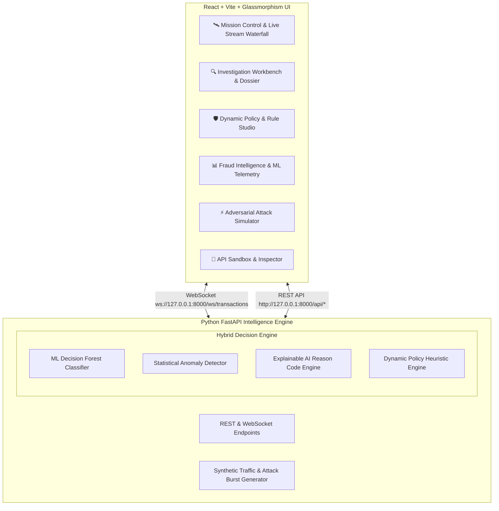

# 🛡️ FraudLens — Real-Time ML Fraud Intelligence & Defense Platform

FraudLens is an enterprise-grade, full-stack fraud detection and analytics platform. It combines machine learning risk scoring, statistical anomaly screening, deterministic policy heuristics, and transparent Explainable AI (XAI) feature attributions within a high-performance dark-mode fintech dashboard.

---

## 🌟 Key Capabilities & Architecture



### 1. 🛰️ Mission Control
- **Executive KPI Telemetry**: Real-time counter of Total Screened, Fraud Threat Rate %, Prevented Loss ($ USD), Active Analyst Backlog, and Sub-millisecond Inference Latency.
- **Threat Level Radar Badge**: Dynamic DEFCON threat state (NOMINAL, ELEVATED, CRITICAL).
- **Live Waterfall Feed**: WebSocket-powered live transaction feed with animated pulse rows, risk badges (LOW, MEDIUM, HIGH, CRITICAL), and instant risk score bars.
- **Multi-Filter & Instant Search**: Filter by Risk Tier, Status, or query by TxID, User ID, Merchant, IP, and Card Last 4.

### 2. 🔍 Investigation Workbench
- **Composite Risk Meter**: Circular animated SVG gauge displaying hybrid score (0-100) with supervised ML probability, rule boost, and anomaly points.
- **Explainable AI (XAI) Reason Codes**: Transparent breakdown of risk contributors (e.g. *"+45% Spending Deviation Spike"*, *"+32% Geographic IP Anomaly"*, *"+28% Anonymizing Infrastructure"*).
- **Entity Dossier**: 30-day baseline vs current spend delta, card BIN/type, physical distance delta from billing address, and hardware fingerprint signature.
- **1-Click Analyst Actions**: Approve (Mark Safe), Decline & Block Card, Escalate to AML Review, and Add Custom Audit Notes.

### 3. 🛡️ Dynamic Policy & Rule Studio
- Pre-configured heuristic policies: Extreme Transaction Value, Rapid Velocity Spikes, Cross-Border Mismatch, High-Risk MCCs (Crypto/Offshore), VPN/TOR Proxy, Impossible Travel Velocity.
- **Interactive Rule Builder**: Create custom threshold policies with custom actions (`FLAG_REVIEW` or `AUTO_DECLINE`) and risk weight boosts.
- Instant toggle switches and real-time trigger counters.

### 4. 📊 Fraud Intelligence & Analytics
- **Risk Tier Breakdown**: Real-time interactive Doughnut chart of Low vs Medium vs High vs Critical distribution.
- **Merchant Category Vulnerability**: Bar chart comparing legitimate volume against intercepted attacks across Crypto, Luxury, Gaming, Electronics, and Retail.
- **Hourly Traffic & Attack Curves**: Multi-line visualization tracking attack waves against baseline clean traffic.
- **Geolocation Hotspot Density**: Country clustering metrics for cross-border attack origins.
- **Model Telemetry**: ROC-AUC (0.984), Precision (96.8%), Recall (94.5%), False Positive Rate (0.38%), and Average Latency (0.92 ms).

### 5. ⚡ Adversarial Attack Simulator
- **Botnet Card Testing Assault**: Emulates automated scripts testing stolen card numbers using rapid $0.99 to $4.99 charges.
- **VIP Account Takeover (ATO)**: Simulates compromised credentials executing unauthorized luxury & wire transfers from foreign devices.
- **Impossible Travel Velocity**: Simulates rapid cross-continent card usage (<15 min delta over >5,000 km).
- **High-Yield Crypto Laundering**: High-value non-custodial crypto deposits routed via commercial TOR proxies.
- **Distributed Botnet Cluster Surge**: Simultaneous multi-user attack with matched canvas fingerprints.

### 6. 🔌 API Developer Sandbox
- Interactive JSON payload editor with pre-filled test templates.
- Real-time `POST /api/evaluate` endpoint screening with full latency, risk score, and reason code output.

---

## 🚀 Running Locally

### 1. Backend (FastAPI)
```bash
cd backend
python -m uvicorn main:app --host 127.0.0.1 --port 8000
```
- **REST API**: http://127.0.0.1:8000/docs (Swagger UI)
- **WebSocket Feed**: `ws://127.0.0.1:8000/ws/transactions`

### 2. Frontend (React + Vite)
```bash
cd frontend
npm run dev
```
- **Web Application**: http://localhost:5173/

---

## 📡 REST API Reference

| Method | Endpoint | Description |
|---|---|---|
| `GET` | `/api/health` | Health status and total transaction count |
| `POST` | `/api/evaluate` | Evaluates a transaction payload and returns risk score + XAI reasons |
| `GET` | `/api/transactions` | Query screened transactions with pagination and filters |
| `GET` | `/api/transactions/{id}` | Retrieve comprehensive dossier & audit notes for a specific case |
| `POST` | `/api/transactions/{id}/action` | Apply analyst decision (`APPROVE`, `BLOCK`, `ESCALATE`) |
| `GET` | `/api/rules` | List all active and disabled policy rules |
| `POST` | `/api/rules` | Deploy a new custom policy rule |
| `PATCH` | `/api/rules/{id}` | Toggle rule status or update thresholds |
| `DELETE` | `/api/rules/{id}` | Delete a custom rule |
| `GET` | `/api/metrics` | Retrieve global fraud metrics, risk distribution, and geo breakdown |
| `POST` | `/api/simulate/attack` | Trigger batch fraud attack simulation |
| `POST` | `/api/stream/control` | Pause/Resume live transaction stream or adjust stream velocity |
